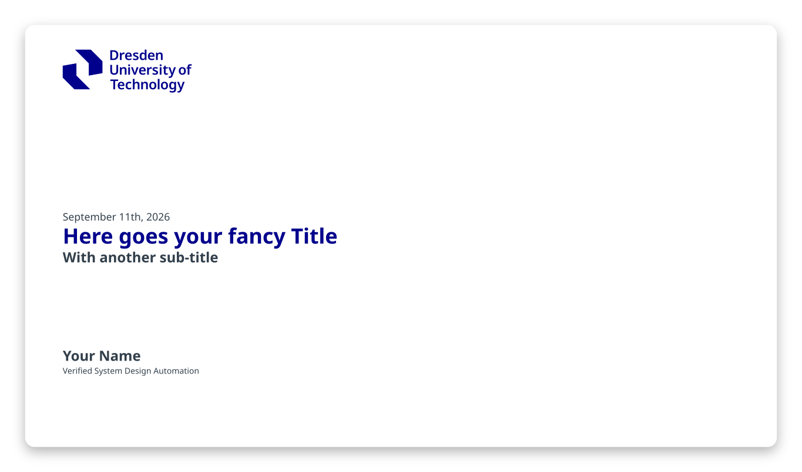

[](https://www.npmjs.com/package/slidev-theme-tud)

# slidev-theme-tud

A [TU Dresden](https://tu-dresden.de/) theme for [Slidev](https://github.com/slidevjs/slidev) (following the [new 2025 corporate desing](https://tu-dresden.de/tu-dresden/organisation/zentrale-universitaetsverwaltung/dezernat-7/sachgebiet-7-1-corporate-design/cd)).



## Usage

You can install this theme into an existing repository using

```bash
$ pnpm install slidev-theme-tud
```

Then you should be able to use it by setting the `theme` in your frontmatter:

```md
---
theme: tud
---
```

Slidev automatically appends the `slidev-theme-` prefix to find the correct package.
(as described [here](https://sli.dev/guide/theme-addon#use-theme)).

## Layouts

This theme provides the following layouts:

- `cover-blue`
- `cover-white`
- `cover`
- `section-blue`
- `section-white`
- `section`
- `default`

## Components

This theme provides the following components:

None

## Contributing

- `pnpm install`
- `pnpm run dev` to start theme preview of `example.mdc`
- Edit the `example.mdc` and style to see the changes

