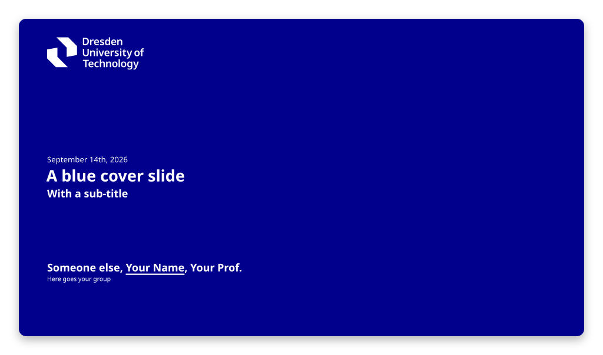
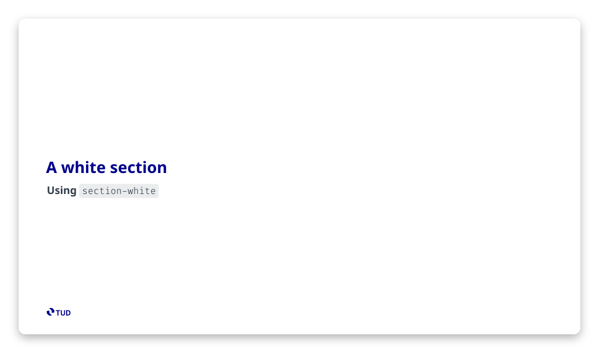
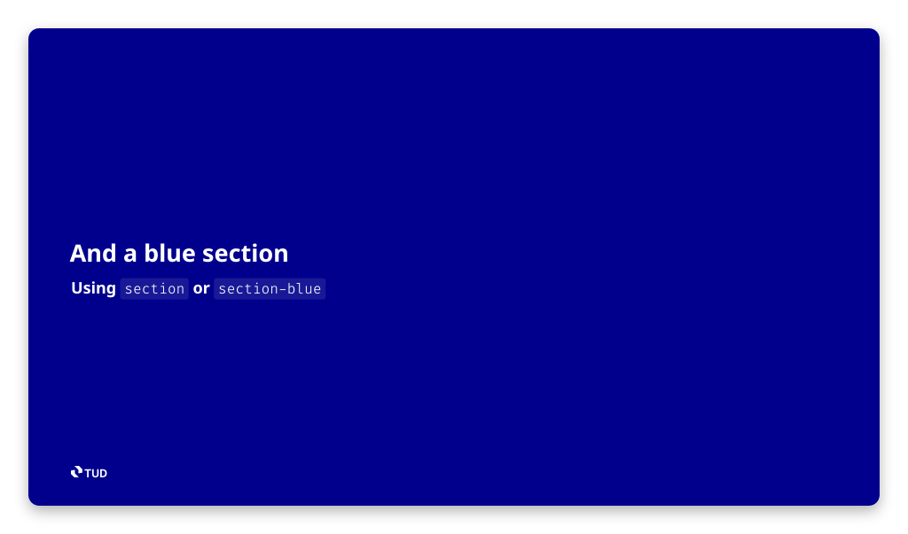
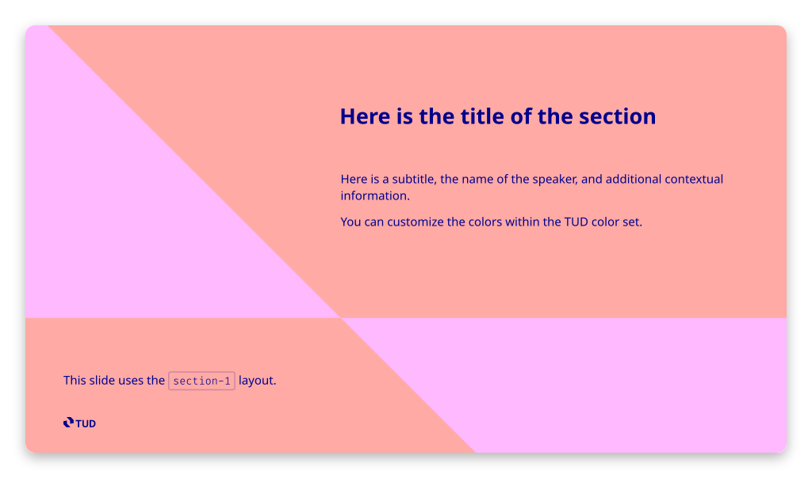
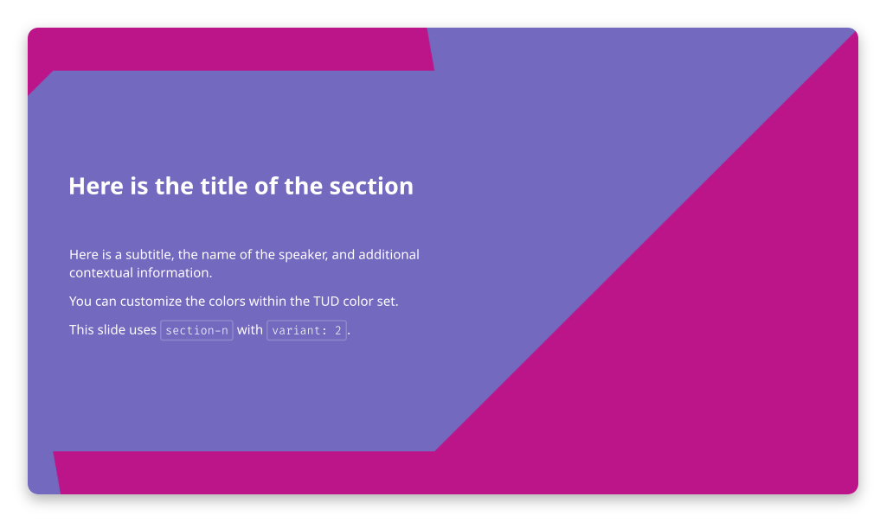
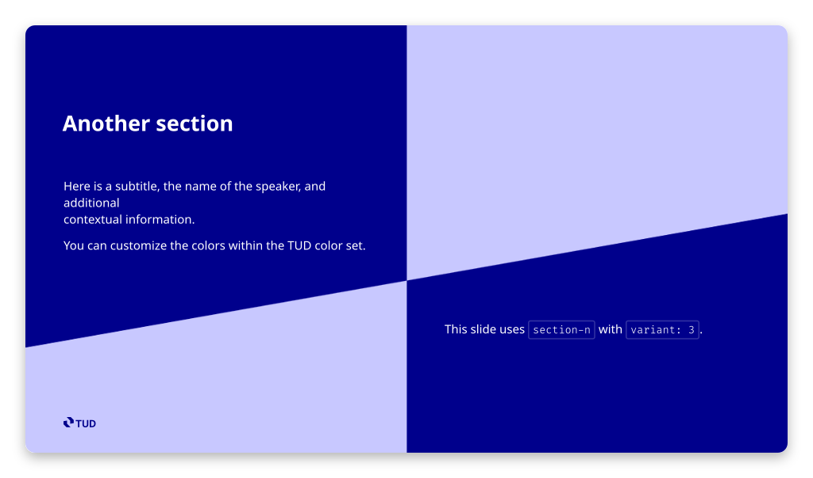
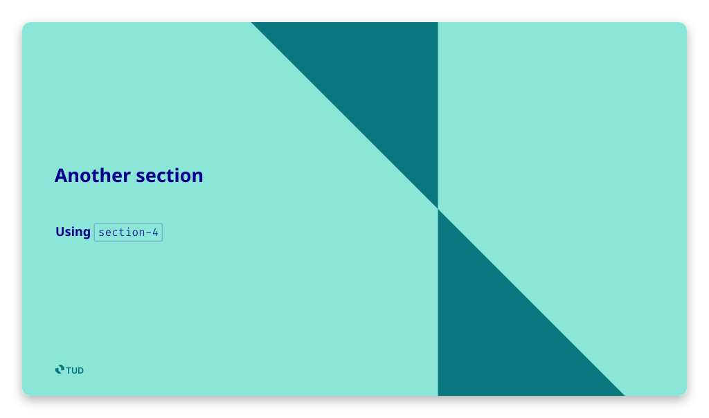
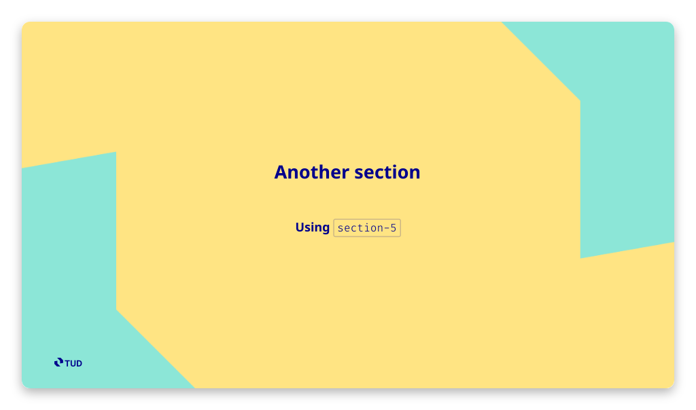
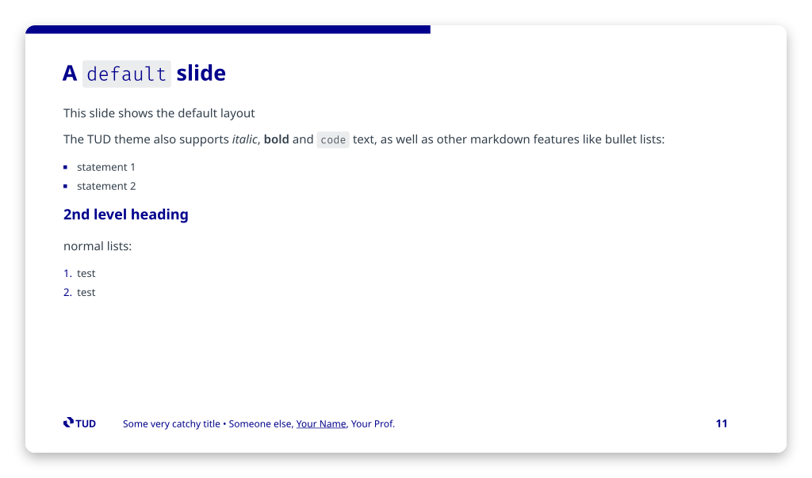
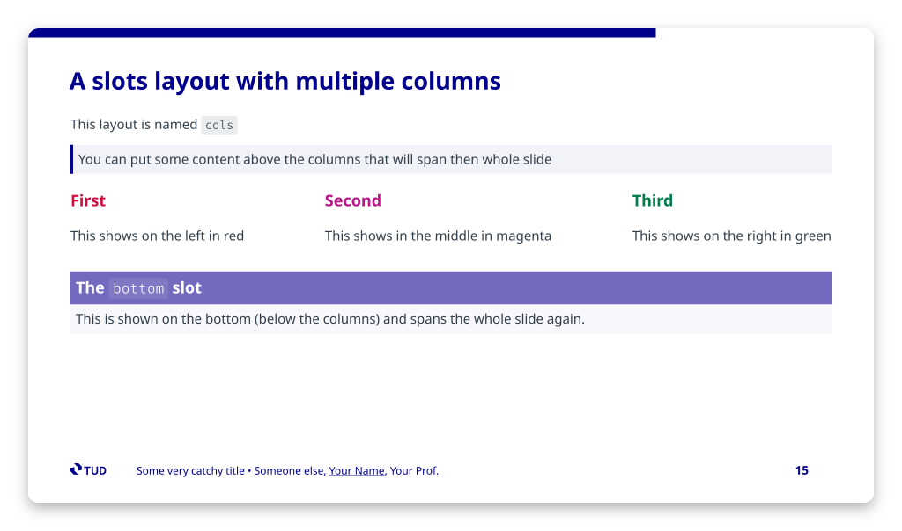

# Layouts

This theme ships fourteen layouts. Every preview below is the corresponding slide of
[`example.mdc`](../example.mdc), which you can run locally with `pnpm run dev`.
Click a preview to open that slide in the
[hosted demo](https://maxkurze1.github.io/slidev-theme-tud/demo/).

| Layout | Purpose |
| --- | --- |
| [`cover-white`](#cover-white) / [`cover-blue`](#cover-blue) / `cover` | Opening slide of a deck |
| [`section-white` / `section-blue` / `section`](#section-white--section-blue) | Plain chapter divider |
| [`section-1` … `section-6`](#section-1--section-6) | Chapter divider built from the TUD logo mark, six compositions |
| [`default`](#default) | Ordinary content slide |
| [`cols`](#cols) | Content slide with side-by-side columns |

`cover` and `section` are aliases for `cover-blue` and `section-blue`.

## Covers

Both cover layouts fall back to the deck's frontmatter, so a cover slide can be
empty. Provide a level-1 heading, a level-2 heading or a paragraph to override
the title, subtitle or author block for that slide only.

```md
---
theme: tud
title: "Some very catchy title"
subtitle: "With a sub-title"
author: "Your Name"
group: "Verified System Design Automation"
# \today renders the current date; \today[YYYY-MM-DD] takes any day.js format
date: '\today'
# optional, shown as "Location • Date"
location: "Dresden"
layout: "cover-white"
---
```

### `cover-white`

[](https://maxkurze1.github.io/slidev-theme-tud/demo/#/1)

```md
---
layout: "cover-white"
---

<!-- Optional: overrides the frontmatter title and subtitle -->
# Here goes your fancy Title

## With another sub-title
```

### `cover-blue`

The same layout on the corporate blue, with the full logo reversed to white.
Also available as `cover`.

[](https://maxkurze1.github.io/slidev-theme-tud/demo/#/2)

```md
---
layout: "cover-blue"
---

# A blue cover slide
```

## Sections

Chapter dividers. `section-white` and `section-blue` (alias `section`) are plain
backgrounds; `section-1` … `section-6` build the divider from an oversized TUD
logo mark, each one a different composition.

| | |
| --- | --- |
| [](https://maxkurze1.github.io/slidev-theme-tud/demo/#/3) | [](https://maxkurze1.github.io/slidev-theme-tud/demo/#/4) |
| `section-white` — plain white background | `section-blue` — the same on corporate blue, also available as `section` |
| [](https://maxkurze1.github.io/slidev-theme-tud/demo/#/5) | [](https://maxkurze1.github.io/slidev-theme-tud/demo/#/6) |
| `section-1` — diagonal split, title top right, `detail` bottom left | `section-2` — mark rotated in from the right, content on the left |
| [](https://maxkurze1.github.io/slidev-theme-tud/demo/#/7) | [](https://maxkurze1.github.io/slidev-theme-tud/demo/#/8) |
| `section-3` — title top left, `detail` bottom right | `section-4` — wedge from the right, content on the left |
| [](https://maxkurze1.github.io/slidev-theme-tud/demo/#/9) | [](https://maxkurze1.github.io/slidev-theme-tud/demo/#/10) |
| `section-5` — mark centred behind centred text | `section-6` — diagonal band behind centred text |

### `section-white` / `section-blue`

Both take the chapter name as a level-1 heading and an optional subtitle as a
level-2 heading:

```md
---
layout: "section-white"
---

# A white section

## Using `section-white`
```

### `section-1` … `section-6`

The number picks both the composition and, by default, a matching color
combination. `section-1` and `section-3` additionally place a `detail` slot in
the opposite corner:

```md
---
layout: "section-1"
---

# Here is the title of the section

Here is a subtitle, the name of the speaker, and additional
contextual information.

::detail::

This slide uses the `section-1` layout.
```

#### Colors

Each layout defaults to the color combination of the same number:

| # | Background | Logo mark | Text |
| --- | --- | --- | --- |
| 1 | `red-2` | `magenta-2` | `primary` |
| 2 | `violet` | `magenta` | `white` |
| 3 | `violet-2` | `primary` | `white` |
| 4 | `teal-1` | `teal-2` | `primary` |
| 5 | `yellow-2` | `teal-2` | `primary` |
| 6 | `magenta-2` | `blue-2` | `primary` |

Override any of them with the `colors` property. Each field takes a palette name
(`green`, `blue-2`, …), any CSS color, or a number to pull that field from
another combination:

```md
---
layout: "section-3"
colors:
  bg: "green-2"
  logo: "green"
  text: "primary"
---

# A green section
```

Passing a number to `bg` or `logo` switches the whole combination, so the
geometry of one layout can be paired with the colors of another:

```md
---
layout: "section-6"   # composition of section 6
colors:
  bg: 4               # ... with the colors of combination 4
---
```

## Content slides

### `default`

The layout used when no `layout` is given. Headings, lists, tables, code blocks,
LaTeX and footnotes all render here — see the second half of
[`example.mdc`](../example.mdc) for the full set.

[](https://maxkurze1.github.io/slidev-theme-tud/demo/#/11)

```md
---
---

# A `default` slide

This slide shows the default layout
```

### `cols`

Splits the slide into columns. Content before the first slot spans the full
width, each `::col-N::` slot becomes a column ordered by its number regardless
of where it appears in the file, and `::bottom::` spans the full width again
underneath.

[](https://maxkurze1.github.io/slidev-theme-tud/demo/#/15)

```md
---
layout: "cols"
---

# A slots layout with multiple columns

> You can put some content above the columns that will span the whole slide

::col-1::

## First {.red}

This shows on the left in red

::col-3::

## Third {.green}

This shows on the right in green

::col-2::

## Second {.magenta}

This shows in the middle in magenta

::bottom::

This is shown below the columns and spans the whole slide again.
```
